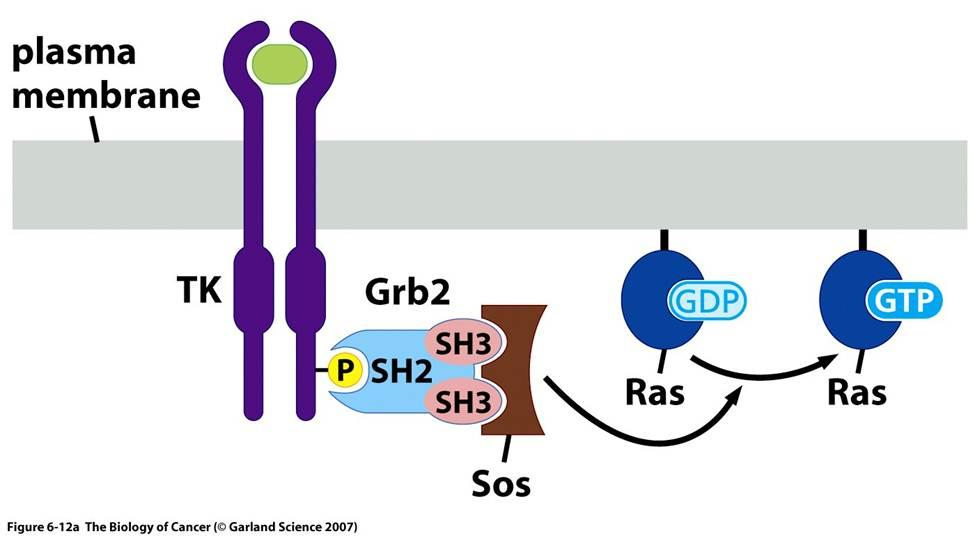
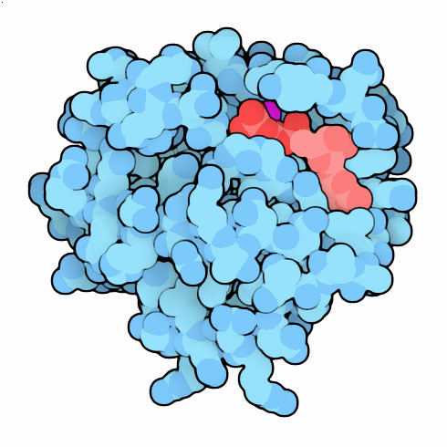
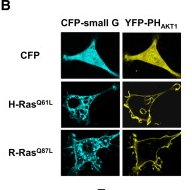

class: inverse, middle, center

# Recap

---

## Türosiinkinaas retseptorite struktuur

.pull-left[

- Inimesel on 58 RTK-d (TK kokku 525 geeni)
- RTK tsütoplasmaatiline domään on konserveerunud.
- Suur varieeruvus rakuvälises domäänis.
]

.pull-right[
```{r, fig.width=500}
knitr::include_graphics("assets/img/rtk-types.jpg")
```

]

.footer[
Pilt: [themedicalbiochemistrypage.org](http://themedicalbiochemistrypage.org/signal-transduction.php#rtk)
]

---
## Mutatsioonid kasvufaktorite retseptorites põhjustavad ligand-sõltumatut aktivatsiooni

```{r}
knitr::include_graphics("assets/img/gf-muts.jpg")
```


.footer[The Biology of Cancer (Garland Science 2007)]

---
## Landscape of recurrent kinase fusions in solid tumours

.pull-left[

```{r}
knitr::include_graphics("http://media.cellsignal.com/www/images/science/diseases/cancer/proteins/alk-ros1/ros-alk-wb-pathway.gif")
```

]
.pull-right[
```{r,out.width=480}
knitr::include_graphics("http://www.nature.com/ncomms/2014/140910/ncomms5846/images/ncomms5846-f1.jpg")
```

]
.footer[Pildid: vasem, cellsignal.com; parem, [Landscape of recurrent kinase fusions in solid tumours](http://www.nature.com/ncomms/2014/140910/ncomms5846/full/ncomms5846.html)]

---
class: inverse, middle, center

# Kasvufaktorid käivitavad signaalirajad

---
## Rakkude kasv ja jagunemine sõltub kasvufaktoritest 

.pull-left[

- 10000 inimese endoteelirakku (HUVEC) külvati  96-welli ja kasvatati 20%FBS söötmes 
- Seejärel rakud sünkroniseeriti rakutsükli G0 faasis, näljutades neid 1%FBS sisaldavas söötmes
- 5%FBS ja VEGF lisamine vabastas rakud blokist ja indutseeris nad jagunema
- Kuidas paneb kasvufaktorite seostumine ja retseptori aktivatsioon käima rakkude jagunemise-kasvu masinavärgi?
]
.pull-right[

```{r, dev='svg'}
library(ggplot2)
library(ggthemes)
load("assets/vegf_huvec.RData")
ggplot(vegf.sign,aes(timeBin,value,color=factor(Conc))) +
  stat_summary(fun.data="mean_se",geom = "line", size=2) +
  scale_color_colorblind(name="VEGF,\nng/ml") +
  xlab("Time, h") + 
  ylab("Impedance @64000 Hz") + 
  geom_vline(xintercept = c(-17.5,0), linetype = "longdash") +
  annotate("text",x=c(-33,-10,18),y=4200,label=c("20%FBS","1%FBS","5%FBS + VEGF"),size=3) +
  annotate("rect", xmin = 0, xmax = 2, ymin = -Inf, ymax = Inf, alpha = .2)
```
]

.footer[Andmed: Anne Pink, Taavi Päll]

---
## Signaaliülekande rada jõuab plasmamembraanist tuuma

.pull-left[

- Kasvufaktorite seostumine retseptoritele käivitab rakus kiire ja vahetu vastuse
- Kasvufaktorite poolt indutseeritakse minutite jooksul kiirelt teatud geenide transkriptsioon
- uute valkude sünteesi ei toimu/ei lähe vaja.
- Selliseid kiirelt ekspresseeritavaid geene nimetatakse **varajasteks geenideks (*immediate early genes*)**.
]

.pull-right[
```{r, out.width=300}
knitr::include_graphics("assets/img/1471-2199-5-13-2.jpg")
```

]

.footer[Pilt: adapteeritud [Expression profiling of serum inducible genes identifies a subset of SRF target genes...](http://www.biomedcentral.com/1471-2199/5/13)
]

---
## Varajasi geene on kokku kusagil sadakond.

```{r}
tab <- readr::read_delim("Geen | Asukoht rakus | Funktsioon
fos | tuum | AP-1 TF komponent
junB | tuum | AP-1 TF komponent
egr-1 | tuum | tsinksõrm TF
nur77 | tuum | steroidretseptor
Srf-1 | tuum | TF
myc | tuum | bHLH TF
$\beta$-aktiin | tsütoplasma | tsütoskelett
$\gamma$-aktiin | tsütoplasma | tsütoskelett
tropomüosiin | tsütoplasma | tsütoskelett
fibronektiin | rakuväline | ECM
glükoositransporter | plasmamembraan | glükoosiimport
JE | rakuväline | tsütokiin
KC | rakuväline | tsütokiin", delim ="|")
tab <- knitr::kable(tab, format = 'html')
kableExtra::kable_styling(tab, "striped", position = "left", font_size = 12)
```

---
## Signaalirajad on rakus ootel ning '*ready to fire*'

- Seerumvabas söötmes arresteerunud rakkude indutseerimisel seerumiga tsükloheksimiidi (valgu sünteesi inhibiitori) juuresolekul toimub varajaste geenide transkriptsioon normaalselt, 
- viidates, et rakus istuvad seega mingid transkriptsioonifaktorid ja ootavad signaali mobiliseerumiseks.
- Lisaks varaste geenide transkriptsiooni indutseerimisele
    - valgusünteesi kiirus suureneb (eIF4E ja eIF4G fosforüülimine)
    - vahetud muutused raku morfoloogias ja migratsioonis

---
## Lisaks muutustele geeniekspressioonis toimuvad muutused ka raku morfoloogias

```{r}
knitr::include_graphics("http://d247mjxbujv0d8.cloudfront.net/content/ajpheart/277/5/H2038/F4.large.jpg?width=800&height=600&carousel=1")
```


.footer[Pilt: [VEGF induced rapid formation of actomyosin stress fibers](http://ajpheart.physiology.org/content/277/5/H2038)
]

---
## Varajastele geenidele järgneb sekundaarsete geenide ekspressiooni laine

.pull-left[

```{r, out.width=480}
knitr::include_graphics("http://www.nature.com/nrm/journal/v12/n2/images/nrm3048-f2.jpg")
```

]

.pull-right[
- Pidevalt jagunevates rakkudes on paljud varajased geenid negatiivse tagasiside mehhanismide tõttu maha reguleeritud
]

.footer[
Pilt: [Feedback regulation of EGFR signalling: decision making by early and delayed loops](http://www.nature.com/nrm/journal/v12/n2/full/nrm3048.html)
]

---
class: inverse, middle, center

# Raku signaaliradade toimimine

---
## Ras valk, osa signaalirajast

- Onkogeenselt aktiveeritud **Ras** (GTPaas) omab rakkudele samasugust transfomeerivat toimet kui **sis** (kasvufaktor) ja **erbB** (retseptor) onkovalgud
- Kuidas need onkogeenid omavahel seotud on?

```{r}
knitr::include_graphics("assets/img/sis-erb-ras-pthwy.png")
```

---
## Son of sevenless

.pull-left[

- Kasvufaktorite retseptoritest lähtuva signalisatsiooni lahendamine sai alguse *Drosophila* geneetikast.
- *Drosophila* silma ommatiidide arengut reguleeriv geen **sevenless** osutus türosiinkinaas retseptoriks, EGF retseptori homoloogiks.
- Edasine geneetiline komplementatsioon identifitseeris signaalirajas 'allpool' toimiva geeni ***son of sevenless*, sos**, mis osutus pärmi G valkude guaniin nuleotiidi vahetus faktorile (GEF) sarnaseks valguks.
]

.pull-right[
```{r, out.width=360}
knitr::include_graphics("http://starklab.slu.edu/sev.jpg")
```

*Drosophila* sevenless mutandil puudub ommatiididest seitsmes rakk ehk on ainult kuus rakku
]

.footer[
Pilt: [Drosophila sevenless mutant](http://starklab.slu.edu)
]

---
## Mis on sevenless-sos signaaliraja biokeemiline alus?

- Lisaks identifiseeriti *Drosophilas* geneetiliselt signaalirajas sevenless ja sos vahel toimivad  adaptervalgud **Shc, Grb2 ja Crk**

```{r}
knitr::include_graphics("assets/img/signaling_cascade.png")
```

---

## Kuidas RTK fosforülatsioon tekitab signalisatsiooni?


Kaks alternatiivset hüpoteesi:

1. p-RTK fosforüleerib ja aktiveerib rakus oma substraate
      - aktiveeritud substraadid signaliseerivad
      - RTK autofosforülatsioon sekundaarse tähendusega

2. p-RTK seob teisi signaalvalke ja muudab nende lokalisatsiooni
      - teiste signaalvalkude sisemine aktiivsus ei muutu
      - moodustuvad signaliseerimiseks soodsad valgukompleksid

---
## SH domäänid vahendavad valkude relokatsiooni
SH -- Src homoloogsed

.pull-left[

- **SH1** kinaasne domään (*Src homology 1*).
- **SH2** fosfotürosiin peptiidide dokkimiskoht
    - inimese genoomis 121 SH2 domääni 115 valgus
- **SH3** proliinirikkaid järjestusi sisaldavate järjestuste dokkimiskoht
    - inimese genoomis ~300 SH3 domääni
]

.pull-right[

```{r, out.width=460}
knitr::include_graphics("http://www.nature.com/nrm/journal/v2/n6/images/nrm0601_467a_f3.gif")
```

]

---
## Valkude dokkimiskohad

.pull-right[

- SH2/3 pasteeritud väga erinevatesse valgulistesse kontekstidesse
    - puhtalt adaptorvalgud ilma katalüütiliste domäänideta (Shc, Grb2)
    - katalüütilisi domääne sisaldavad valgud (Src)
 ]
 
.pull-left[

```{r}
knitr::include_graphics("http://www.nature.com/nrm/journal/v3/n3/images/nrm759-f1.gif")
```

]
---
## RTK tsütoplasma domään sisaldab fosfo sidumissaite erinevatele valkudele

.pull-left[

+ RTK-dega assotseeruvate valkude biokeemiline mitmekesisus seletab kasvufaktorite võimet aktiveerida erinevaid signaaliradu.
```{r, out.width=460}
knitr::include_graphics("assets/img/nrm1960-f4.jpg")
```

]

.pull-right[

```{r}
knitr::include_graphics("assets/img/1-s2.0-S0968000412001934-gr3.jpg")
```

]

---
## Olulisemad mitogeense signalisatsiooniga seotud dokkimisdomäänid


```{r}
tab <- readr::read_delim("Domään | Ligand | Domääni kandvaid valke
SH2 | fosfotürosiin | Src (kinaas), Grb2 (adapter), Shc (adapter), SHP2 (fosfataas), Cbl (ubikvitiini ligaas)
PTB | fosfotürosiin | Shc, IRS-1 (insuliini RTK adapter)
SH3 | proliinirikkad järestused | Src, Crk (adapter), Grb2, Cdc25 (CDK fosfataas), Bad (apoptoosi regulator), Raf (ser/thr kinaas), PKC (*protein kinase C*, ser/thr kinaas) 
Bromo | atsetüleeritud lüsiin | P/CAF (transkriptsiooni kofaktor), kromatiinivalgud
PH | fosfoinositool | PLC-$\delta$ (fosfolipaas C), Akt/PKB (ser/thr kinaas)", delim ="|")
tab <- knitr::kable(tab, format = 'html')
kableExtra::kable_styling(tab, "striped", position = "left", font_size = 12)
```


---
## sevenless-sos signaaliraja biokeemiline alus

```{r}

```


---
## SH2 grupid vahendavad Ras aktivatsiooni RTK-de poolt

- türosiinkinaas retseptor-P $\rightarrow$ SH2-Shc-P $\rightarrow$ SH2-Grb2-SH3 $\rightarrow$ proline-rich-Sos $\rightarrow$ Ras
- türosiinkinaas retseptor-P $\rightarrow$ SH2-Grb2-SH3 $\rightarrow$ proline-rich-Sos $\rightarrow$ Ras

```{r}
knitr::include_graphics("http://www.nature.com/nrm/journal/v13/n1/images/nrm3255-f1.jpg")
```

---
## Ras valgud

.pull-left[

- **Ras valgud toimivad GDP/GTP-sõltuvate lülititena.**
- Ras-GDP: inaktiivne/Ras-GTP: aktiivne.
- Normaalselt on rakkudes Ras seotud GDP-ga ja  mitteaktiivne.
- Rakuvälised stiimulid (nt. TGF-$\alpha$) põhjustavad transientse Ras-i aktivatsiooni.

]  

.pull-right[

```{r, out.width=460}
knitr::include_graphics("http://www.frontiersin.org/files/Articles/57883/fimmu-04-00239-HTML/image_m/fimmu-04-00239-g001.jpg")
```

]

.footer[
Veel: [A comprehensive survey of Ras mutations in cancer](http://www.ncbi.nlm.nih.gov/pmc/articles/PMC3354961/), [The GAP arginine finger movement into the catalytic site of Ras increases the activation entropy](http://www.pnas.org/content/105/17/6260.full) 
]

---
## Mutantne Ras on lakkamatult aktiivne

.pull-left[

- Ras toimib molekulaarse lülitina, mis aktiveeritakse GTP seostumisel
- Ras-i sisse ja välja lülitamist reguleerivad GEF (*guanine nucleotide exchange factor*) ja GAP (*GTPase-activating protein*) valgud
- GAP valgu seostumine tõstab Ras GTP hüdrolüüsi kiirust ~$10^{5}$ korda
- Onkogeenselt aktiveeritud Ras mutantidel (nt. G12D, G12V) on GTP hüdrolüüs (väljalülitumine) rikutud.
]

.pull-right[

```{r}

```

[April 2012 Molecule of the Month](http://pdb101.rcsb.org/motm/148)

]

---
## Ras isovormid

.pull-left[

- Ras-i on kolm geeni: **K-Ras, H-Ras, N-Ras**
- K-Ras-il on kaks splaissingu isovormi:K-Ras-4A/B
- Ras valkude G-domääni struktuurid on identsed, 
- kuid C-terminaalsed hüpervariaablid domäänid erinevad.

]

.pull-right[

```{r}
knitr::include_graphics("http://ars.els-cdn.com/content/image/1-s2.0-S1535610814000816-gr3.jpg")
```

]

---
## Ras isovormide sagedus vähis

Ras mutatsioonid on sagedased. K-Ras on enamasti suveräänne liider (va. N-RAS melanoomis).


```{r}
tab <- readr::read_delim("Primaarne kude |  KRAS (%)	| HRAS (%)	| NRAS (%) |	Kokku (%)
pankreas |	71	|0	| <1 |	71
koolon	| 35 |	1 |	6 |	42
peensool	| 35 |	0	| <1 |	35
sapijuha	| 26	| 0 |	2	| 28
endomeetrium	|17	| <1	| 5	| 22
kops	| 19	| <1 |	1	| 20
nahk (melanoom)	| 1	| 1 |	18 |	20
emakakael	| 8	| 9	| 2	| 19
kusejuha	| 5	| 10	| 1	| 16", delim ="|")
tab <- knitr::kable(tab, format = 'html')
kableExtra::kable_styling(tab, "striped", position = "left", font_size = 12)
```


Lisaks mutatsioonidele on alternatiivselt Ras aktiveeritud ka läbi **neurofibromiini** (Ras-GAP) somaatiliste deletsioonide: 14% glioblastoom, 13-14% melanoom, 8-10% kopsu adenokartsinoom, jne.

---
## Ras aktivatsioonil vabaneb tema '*effector loop*'

.pull-left[

- **Receptacle for effectors** comprises the so-called 'SWITCH REGIONS', which are three short segments that border the nucleotide-binding site. 
     - **P-loop** coordinates nucleotide binding, 
     - **switch I and II** regions make up a mobile binding surface that conforms to the nature of a bound nucleotide

]

.pull-right[

```{r}
knitr::include_graphics("assets/img/rasloop.jpg")
```

]

.footer[
Pilt: doi:10.1038/nrm1229
]

---
## Ras aktiveerib kolm põhilist signaalirada

.pull-left[

Aktiveeritud Ras seotub ja aktiveerib oma effektorvalke:
- **Raf kinaas**
- **Fosfatidüülinositool 3 kinaas, PI3K**
- **RalGDS (Ral GEF)**

```{r}
knitr::include_graphics("http://ars.els-cdn.com/content/image/1-s2.0-S1535610814000816-gr1.jpg")
```

]

.pull-right[

```{r}
knitr::include_graphics("assets/img/RasPI3K.jpg")
```

]

---
## MAPK rada

.pull-left[

- Ras-Raf-MEK-ERK signaalirada
- MAPK rada aktiveeritkse vastusena kasvufaktorite stimulatsioonile, 
- Paljud MAPK raja substraadid on transkriptioonifacktorid (Ets, Elk-1 SAP-1) aga ka valgusüntees üle Mnk1 kinaasi vahendatud eIF4E aktivatsiooni

]

.pull-right[

```{r, out.width=400}
knitr::include_graphics("http://clincancerres.aacrjournals.org/content/16/13/3329/F1.large.jpg")
```

]

.footer[
Image: clincancerres.aacrjournals.org
]

---
## MAPK raja onkogeenne aktivatsioon
```{r}
knitr::include_graphics("http://www.nature.com/onc/journal/v26/n22/images/1210422f1.jpg")
```

.footer[
FROM:Targeting the Raf-MEK-ERK mitogen-activated protein kinase cascade for the treatment of cancer. P J Roberts and C J Der
]

---
## Fosfatidüülinositool 3 kinaas, PI3K rada

.pull-left[

```{r}
knitr::include_graphics("assets/img/RasPI3K.jpg")
```

Ras - PI3K$\gamma$ kompleks

]

.pull-right[

- Ras seostumisel PI3Kinaasile aktiveeritakse selle katalüütline domään. 
- PI3K-$\gamma$ on lipiidkinaas. 
- PI3K-$\gamma$ hakkab fosforüleerima plasmamembraanis olevaid fosfatidüül-inositool-4,5-difosfaate (PIP2). 

]

---
## PI3K fosforüülib PIP2>PIP3

```{r}
knitr::include_graphics("http://www.babraham.ac.uk/files/large/f4d5128f14fe6cb")
```

---
## Akt kinaas seostub üle oma PH domääni plasmamebraanile

- PIP3 vahendab PH-domääni sisaldava Akt kinaasi relokatsiooni plasmamembraanile

```{r}

```

---
## Akt/PKB rada mõjutab rakkude ellujäämist, jagunemist ja kasvu


```{r}
tab <- readr::read_delim("Bioloogiline effekt | Akt/PKB substraat | Funktsionaalne tagajärg
Anti-apoptootiline |                    | 
                   | Bad (pro-apopootline) | inhibitsioon
                   | kaspaas-9 (pro-apopootline) | inhibitsioon
                   | I$\kappa$B kinaas (anti-apopootline) | aktivatsioon
                   | FOXO1 TF (pro-apopootline) | inhibitsioon
                   | Mdm2 (anti-apopootline) | aktivatsioon
Rakkude jagunemine |                     |       
                   | GSK-3$\beta$ (anti-proliferatiivne) |  inhibitsioon
                   | FOXO4 TF (anti-proliferatiivne) | inhibitsioon
                   | p21 (anti-proliferatiivne) | inhibitsioon
Kasv (suurus) |            |
              | Tsc2 (kasvu pidurdav) | inhibitsioon", delim ="|")
tab <- knitr::kable(tab, format = 'html')
kableExtra::kable_styling(tab, "striped", position = "left", font_size = 12)
```


---
# Genetic Alterations in the PI3K/Akt Pathway in Cancer

```{r}
tab <- readr::read_delim("Gene | Type of Alteration	| Tumor Lineage
PTEN |	Loss-of-function by somatic mutation |	Brain, prostate, endometrium
     | Germline mutation (in 80% of Cowden Disease)	| Cowden disease: Increased risk for breast, thyroid, genitourinary and endometrial cancer
 | Promoter methylation	| Melanoma, breast, colon
 | Loss of heterozygosity	| Prostate, melanoma, thyroid, breast, pancreas, ovary, brain, bladder, endometrium, cervix, head and neck, kidney, lung
p110α	| Gain-of-function by somatic mutation |	Colon, breast, brain, ovary
  | Amplification	| Ovary, gastric, lung, cervix
p85	| Gain-of-function by somatic mutation |	Brain, colon, ovary
AKT1 |	Gain-of-function by somatic mutation |	Breast, colorectal, ovary
AKT2 |	Amplification	 | Ovary, lymphoma, pancreas
     | Mutation	| Colorectal
PDK1 |	Mutation	| Colorectal
TSC1/2	| Loss-of-function by mutation (occasionally with concomitant loss of heterozygosity for the wild type allele) |	Tuberous sclerosis (hamartomas of the skin, brain and kidney; rare progression to malignancy)
TSC1	| Mutation |	Bladder", delim ="|")
tab <- knitr::kable(tab, format = 'html')
kableExtra::kable_styling(tab, "striped", position = "left", font_size = 12)
```


---
## Ras-RalGDS rada

.pull-left[

- Ral-GDS(*guanine nucleotide dissociation stimulator*, GEF) aktiveerib RalA ja RalB GTPaasid
- Ral effektorid on RalBP1 mis on Rac/Cdc42 GAP, Sec5 ja Exo84 mis on eksotsüst-kompleksi subühikud, Y-box transkriptsioonifaktor ZONAB
-  Ral rada reguleerib seega rakkude morfoloogiat, kasvufaktorite retseptorite endotsütoosi, vesikulaarset transporti  ja transkriptsioonifaktoreid

]

.pull-right[

```{r}
knitr::include_graphics("http://www.nature.com/nrc/journal/v8/n2/images/nrc2296-f1.jpg")
```

]

---
## Jak-STAT rada signaliseerib otse tuuma

.pull-left[

- Interferooni (IFN), erütropoietiini (EPO) ja trombopoietiini (TPO) retseptorid moodustavad mittekovalentse kompleksi Jak türosiin kinaasidega
- Ligandi seostumisel rist-aktiveeritakse kinaasid ja fosforüleeritakse retseptorite sabad, millele seostuvad üle SH2 domäänide STAT transkriptsioonifaktorid
- Seostunud STAT-ide fosforüleerimisel moodustavad need üle SH2 domäänide dimeeri ja translokeeruvad tuuma

]

.pull-right[

```{r, out.width=460}
knitr::include_graphics("http://blogs.shu.edu/cancer/files/2014/08/figure_06_22.jpg")
```

]

---
## Jak-STAT vähis

- STAT aktiveerivad muuseas mitmeid rakkude jagunemiseks, ellu jäämiseks ja angiogeneesiks oluliste geenide transkriptsiooni: myc, tsükliinid D2 ja D3 ja anti-apoptootiline Bcl-XL, VEGF 
- JAK2 V617F mutatsioon multimüeloomides
- STAT3 konstitutiivne aktivatsioon mitmetes kasvajates, sh. melanoomis, rinnakasvajates, pea-kaela lamerakulistes kartsinoomides
- STAT3 aktivatsioon vahendatud ilmselt üle Src-i

---
## Integriini osalevad kasvufaktorite signalisatsioonis 

.pull-left[

- Aktiveeritud integriinidele seostunud FAK (*focal adhesion kinase*) fosforüleerimisel Src poolt tekivad FAK-ile SH2 dokkimiskohad, sh Grb2, Shc, PI3K, PLC-y
- FAK seostunud Grb2 seob ka Sos-i on seega võimeline aktiveerima Ras-Raf rada 
- Integriin vahendatud Ras aktivatsioon võib seletada miks transformatsiooniga kaasneb adhesioon sõltumatu kasv
]

.pull-right[

```{r}
knitr::include_graphics("http://www.nature.com/ncb/journal/v4/n4/images/ncb0402-e83-f1.gif")
```

]

---
## Wnt-$\beta$-kateniin rada 

.pull-left[

- Rada toimib β-kateniini stabiilsuse ja transkriptsioonilise aktiivsuse kontrollina
- Ligandi puudumisel toimub Axini kompleks vahendatud $\beta$-kateniini lagundamine
- Axin kompleks: struktuurvalgud Axin ja tuumor suppressor *adenomatous polyposis coli* (APC), casein kinase 1 (CK1) ja glycogen synthase kinase 3 (GSK3)
- CK1 ja GSK3 fosforüleerivad $\beta$-kateniini N-terminusest mistõttu selle tunneb ära $\beta$-Trcp E3 ubiquitin ligaasi subühik ja  $\beta$-kateniin ubiquitineeritakse ja lagundatakse proteasoomis

]

.pull-right[

```{r,fig.width=460}
knitr::include_graphics("http://www.nature.com/nrg/journal/v5/n9/images/nrg1427-f1.jpg")
```

]

---
## Wnt raja mutatsioonid vähis

```{r}
tab <- readr::read_delim("Affected gene	| DNA/mRNA alteration	| Functional outcome |	Cancer type	
CTNNBl (b-catenin) |	Missense/in-frame deletion	| Enhanced protein stability |	Hepatocellular/Medulloblastoma
APC (APC)	| Truncation	|Reduced regulatory activity|	Colorectal/gastric
Axins (Axin I, Axin II)|	Truncation/missense|	Reduced regulatory activity|	Hepatocellular/colorectal	
CREBP(CBP)|	Truncation/ missense|	Inactive acetyltransferase|	Lymphoma/leukemia
GSK3b	|Missplicing, in-frame deletion|	Inactive kinase	|Leukemia
LRP5|	Missplicing, in-frame deletion|	Loss of repression by DKK1	|Breast/parathyroid	
TCF7L2 (TCF4)|	Missense/deletion/truncation|	Loss of repression	|Colorectal	
TCF7L2 (TCF4)|	Fusion with VT11A gene|	Unclear	|Colorectal
FAB123B (WTX)	|Truncation/deletion|	Loss of function|	Wilm’s tumor", delim ="|")
tab <- knitr::kable(tab, format = 'html')
kableExtra::kable_styling(tab, "striped", position = "left", font_size = 12)
```


.footer[
Tabel: [Wnt Signaling in Cancer](http://www.ncbi.nlm.nih.gov/pmc/articles/PMC3331705/)
]

---
## Hedgehog rada

.pull-left[

- HH ligandid, imetajatel sonic hedgehog (SHH), Indian hedgehog (IHH) ja desert hedgehog (DHH) seostuvad patched 1 (PTCH1) retseptorile
- Ligandi seostumine PTCH1-le vabastab smoothened (SMO) transmembraanse valgu inhibitsioonist 
- SMO signalisatsioon vabastab GLI1, GLI2 ja GLI3 transkriptsioonifaktorid inhibitsioonist tuumorsuppressorvalgu suppressor of fused (SUFU) poolt 
- GLI1, GLI2 ja GLI3 transporditakse tuuma

]

.pull-right[

```{r,fig.width=460}
knitr::include_graphics("https://www.dovepress.com/cr_data/article_fulltext/s60000/60262/img/fig1.jpg")
```

]

.footer[
Pilt: [Hedgehog-Gli signaling in basal cell carcinoma and other skin cancers](https://www.dovepress.com/hedgehog-gli-signaling-in-basal-cell-carcinoma-and-other-skin-cancers--peer-reviewed-fulltext-article-RRB)
]

---
## Hedgehog rada vähis

- Imetajatel on SUFU Gli aktiivsuse peamine regulator
- Pärilikud SUFU mutatsioone on leitud medulloblastoomi, meningioomi patsientidel ja on seotud Gorlini sündroomiga, millega kaasneb kõrge risk saada basaalrakuline kartsinoom 
- SUFU somaatilisi mutatsioone ja deleteerumist on leitud medulloblastoomides, kondrosarkoomides ja rhabdomüosarkoomides

---
## HH raja mutatsioonid nahavähkides

```{r}
tab <- readr::read_delim("Gene|	Mutation type	|Tumor type	|Percent mutated samples
Ptch I|	Loss-of-function, nonsense|	BCC	|40-67
	|Missense, nonsense, splice site|	BCC	|75
	|Missense, nonsense|	cSCC|	17
	|Missense, nonsense, homozygous deletion|	Melanoma|	3-5.5
SMO|	Gain-of-function, missense|	BCC|	9.5-20.6
	|Missense|	cSCC|	7.7
	|Missense, nonsense, amplification|	Melanoma|	2.2-8
SUFU|	Missense|	BCC|	4.7
	|Missense|	cSCC|	2.6
	|Missense|	Melanoma|	0.7-3.3
Shh|	Translocation|	BCC|	One case
	|Missense, frameshift|	cSCC	|17.9
	|Missense, amplification|	Melanoma	|0-4.7
HHIP|	Missense, nonsense, amplification|	Melanoma|	6.6-9.1
	|Missense|	cSCC	|30.7
Gli1|	Missense, nonsense, amplification|	Melanoma	|1.1-7.2
	|Missense, nonsense|	cSCC	|23
Gli2|	Missense, nonsense, amplification|	Melanoma|	2.2-12.2
	|Missense, nonsense|	cSCC	|25.6
Gli3|	Missense, splice site, amplification|	Melanoma|	3.3-7.2
	|Missense, nonsense|	cSCC|	23", delim ="|")
tab <- knitr::kable(tab, format = 'html')
kableExtra::kable_styling(tab, "striped", position = "left", font_size = 10)
```


.footer[
Tabel: [Hedgehog-Gli signaling in basal cell carcinoma and other skin cancers](https://www.dovepress.com/hedgehog-gli-signaling-in-basal-cell-carcinoma-and-other-skin-cancers--peer-reviewed-fulltext-article-RRB)
]

---
class: inverse, middle, center

# Lingid teistele loengutele

--- 

.pull-left[ 

- [Sissejuhatav loeng](http://tpall.github.io/onkobioloogia)
- [Viirused ja onkogeenid](http://tpall.github.io/viirused-ja-onkogeenid)
- [Retseptorid](http://tpall.github.io/Retseptorid)
- [Signaalirajad](http://tpall.github.io/Signaalirajad)
- [Tuumorsupressorgeenid](http://tpall.github.io/Tuumorsupressorid)
- [Rakutsüklikontroll](http://tpall.github.io/Rakutsyklikontroll)
]

.pull-right[ 

- [p53 ja apoptoos](http://tpall.github.io/p53-ja-apoptoos)
- [Immortalisatsioon](http://tpall.github.io/Immortalisatsioon)
- [Tumorigenees](http://tpall.github.io/Tumorigenees)
- [Genoomiterviklikkus](http://tpall.github.io/Genoomiterviklikkus)
- [Mikrokeskkond](http://tpall.github.io/Mikrokeskkond)
- [Metastaasid](http://tpall.github.io/Metastaas)
- [Immuunsus](http://tpall.github.io/Immuunsus)
- [Vähiravimid](http://tpall.github.io/Vahiravim)
]
