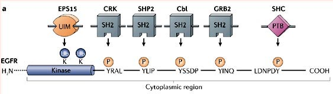
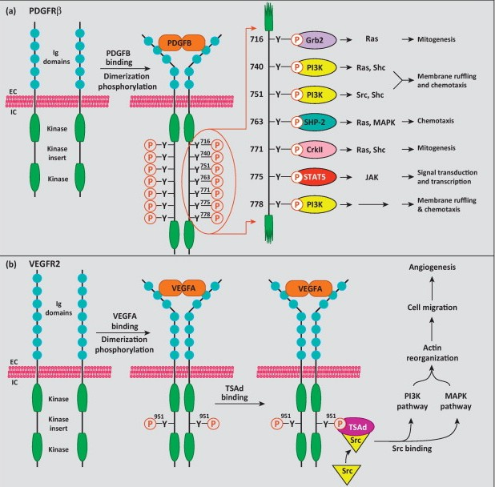

<!-- Limit image width and height -->

<!-- Center image on slide -->

<!-- Italic -->

<!-- Bold -->

--- .segue .dark .nobackground
## Recap

---&twocol
## Src: tsütoplasma türosiin kinaas

***=left

- **SH1** kinaasne domään (*Src homology 1*).
- **SH2** fosfotürosiin valkude dokkimiskoht
    - inimese genoomis 121 SH2 domääni 115 valgus.
- **SH3** proliinirikkaid järjestusi sisaldavate valkude dokkimiskoht
    - inimese genoomis ~300 SH3 domääni.

***=right

---&twocol
## Retseptor türosiin kinaasid

***=left

- Tsütoplasmaatiline **kinaasne domään** on konserveerunud,
    - homoloogne Src-i kinaasse domääniga.
- Suur varieeruvus rakuvälises domäänis.
- RTK aktivatsioon toimub kasvufaktori seostumisel ja **retseptori dimeriseerumisel**.
- Dimeriseerunud retseptorid **trans-fosforüleerivad** teineteise tsütoplasma sabad.

***=right

---&twocol
## RTK aktivatsioon vähkides

***=left
- Enamus muutusi on RTK-de geenides seotud **koopiaarvu muutustega** (nt. FGFR4, EGFR, HER2 üle-ekspressioon HER2+-rinna adenokartsinoomides, ~10%).
- **Mutatsioonid** põhjustavad ligand-sõltumatut aktivatsiooni (nt. EGFRvIII).
- **Geenifusioonid** mis viivad konstitutiivse homodimeriseerumiseni (ALK, RET, ROS1 translokatsioonid kopsuvähkides, ~5% kokku).
- **Autokriinsed kasvufaktorid**.

***=right

Heatmap of 17q12  HER2 amplicon copy number changes. doi:10.1016/j.molonc.2012.10.012

---.segue .dark .nobackground
## Rakuvälise maatriksi retseptoritest

--- &twocol
## Integriinid

***=left

doi:10.1038/nrm1229

***=right

- Rakuvälise maatriksi (**ECM**) retseptorid.
- Heterodimeerid: 18 $\alpha$- ja  8 $\beta$ -subühikut.
- Rakkude **adhesioon**, **migratsioon**, **anoikis**.
- Integriinide tsütoplasmaatilised sabad seovad mitmeid valke, nt. **taliin, vinkuliin, $\alpha$-aktiniin**, mis seostuvad aktiini tsütoskeletile ja seeläbi vahendavad kõiki integriini rakulisi funtsioone.
- **Seest-välja (*inside-out*) signalisatsioon** reguleerib integriini afiinsust,
    - integriini subühikute tsütoplasma sabade vaheline interaktsioon takistab aktivatsiooni.

---
# $\alpha$- ja  $\beta$-subühikute kombinatsioonid tagavad spetsiifilisuse

doi:10.1186/gb-2007-8-5-215

---
# Näited integriinide ECM ligandidest

Integriin | ECM ligand
----------|-----------
$\alpha 1\beta 1$ | kollageen, laminiin, vitronektiin, fibronektiin
$\alpha v\beta 3$ | vitronektiin, fibrinogeen, trombospondiin (angiogenees)
$\alpha 5\beta 1$ | fibronektiin
$\alpha 6\beta 1$ | laminiin
$\alpha 7\beta 1$ | laminiin
$\alpha 2\beta 3$ | fibrinogeen
$\alpha 6\beta 4$ | laminiin (epiteliaalsed hemidesmosoomid)

[Ligand-binding specificities of human integrins](http://genomebiology.com/2007/8/5/215/table/T2)

---&twocol
## Integriinid organiseerivad raku adhesioonid

Rakkude adhesioonid on multivalk kompleksid millel on mehhaanilised ja signaali üle kandvad funktsioonid.

***=left

***=right

---&twocol
## $\beta 1$-integriin vähi arengus

***=left

- $\beta 1$-integriin on hiire rinnavähi mudelis vajalik  kasvaja tekkes ja hilisemas faasis vähirakkude jagunemisvõime säilitamiseks. *Ablation of β1-integrin expression impairs mammary tumorigenesis in MMTV/PyV MT mice*, [doi:10.1016/j.ccr.2004.06.025](http://www.sciencedirect.com/science/article/pii/S1535610804002077) (kõrval olev pilt).

- Inimese vähkides on β1 integriinid üle ekspresseeritud nt. pea-kaela lamerakulises kartsinoomis (*HNSCC*) ja määrab kasvajarakkude resistentsuse radioteraapiale, [doi:10.1172/JCI61350](http://www.jci.org/articles/view/61350).

***=right

---.segue .dark .nobackground
## RAS-ist

---&twocol
## Ras valgud

***=left

- **Ras valgud toimivad GDP/GTP-sõltuvate lülititena.**
- Ras-GDP: inaktiivne/Ras-GTP: aktiivne.
- Normaalselt on rakkudes Ras seotud GDP-ga ja  mitteaktiivne.
- Rakuvälised stiimulid (nt. TGF-$\alpha$) põhjustavad transientse Ras-i aktivatsiooni.
    
***=right

---&twocol
## Mutantsed Ras valgud on GAP-tundetud

***=left

- **GDP$\leftrightarrow$GTP vahetust stimuleerivad GEF ja GAP valgud**
    - **GEF** (*guanine nucleotide exchange factor*): laadib Ras-i uue GTP-ga
    - **GAP** (*GTPase activating factor*): hüdrolüüsib GTP.
- Ras-i endogeenne GTP hüdrolüüs 100'000$\times$ madalama kiirusega GAP-vahendatud hüdrolüüsist!
- **Vähkides esinevad Ras mutatsioonid koodonites 12, 13 ja 61 rikuvad ära GAP-valkude seostumise.**

***=right

[April 2012 Molecule of the Month](http://www.rcsb.org/pdb/101/motm.do?momID=148&evtc=Suggest&evta=Moleculeof%20the%20Month&evtl=OtherOptions)

---&twocol
## Ras isovormid

***=left

- Ras-i on kolm geeni: **K-Ras, H-Ras, N-Ras**
- K-Ras-il on kaks splaissingu isovormi:K-Ras-4A/B
- Ras valkude G-domääni struktuurid on identsed, 
- kuid C-terminaalsed hüpervariaablid domäänid erinevad.

***=right

---&twocol
## Ras isovormide sagedus vähis

Ras mutatsioonid on sagedased. K-Ras on enamasti suveräänne liider (va. N-RAS melanoomis).

Primaarne kude |  KRAS (%)	| HRAS (%)	| NRAS (%) |	Kokku (%)
---------------|------------|-----------|----------|----------
pankreas |	71	|0	| <1 |	71
koolon	| 35 |	1 |	6 |	42
peensool	| 35 |	0	| <1 |	35
sapijuha	| 26	| 0 |	2	| 28
endomeetrium	|17	| <1	| 5	| 22
kops	| 19	| <1 |	1	| 20
nahk (melanoom)	| 1	| 1 |	18 |	20
emakakael	| 8	| 9	| 2	| 19
kusejuha	| 5	| 10	| 1	| 16

Lisaks mutatsioonidele on alternatiivselt Ras aktiveeritud ka läbi **neurofibromiini** (Ras-GAP) somaatiliste deletsioonide: 14% glioblastoom, 13-14% melanoom, 8-10% kopsu adenokartsinoom, jne.

---.segue .dark .nobackground
## Raku signaalirajad

---
## Immediate early geenid

Kasvufaktorite seostumine retseptoritele käivitab rakus kiire ja vahetu vastuse

- Kasvufaktorite poolt indutseeritakse minutite jooksul kiirelt teatud geenide transkriptsioon ilma, et *de novo* valgusünteesi vaja läheks.
- Selliseid kiirelt ekspresseeritavaid geene nimetatakse **varajasteks (*immediate early*) geenideks**.

---
# Varajasi geene on kokku kusagil sadakond.

Geen | Asukoht rakus | Funktsioon
-----|---------------|----------
fos | tuum | AP-1 TF komponent
junB | tuum | AP-1 TF komponent
egr-1 | tuum | tsinksõrm TF
nur77 | tuum | steroidretseptor
Srf-1 | tuum | TF
myc | tuum | bHLH TF
$\beta$-aktiin | tsütoplasma | tsütoskelett
$\gamma$-aktiin | tsütoplasma | tsütoskelett
tropomüosiin | tsütoplasma | tsütoskelett
fibronektiin | rakuväline | ECM
glükoositransporter | plasmamembraan | glükoosiimport
JE | rakuväline | tsütokiin
KC | rakuväline | tsütokiin

---
## Signaalirajad on rakus ootel ning '*ready to fire*'

- Seerumvabas söötmes arresteerunud rakkude indutseerimisel seerumiga **tsükloheksimiidi** (valgu sünteesi inhibiitor) juuresolekul toimub varajaste geenide transkriptsioon normaalselt, 
- viidates, et rakus istuvad seega mingid transkriptsioonifaktorid ja ootavad signaali mobiliseerumiseks.

---&twocol
## Son of sevenless

***=left

- Kasvufaktorite retseptoritest lähtuva signalisatsiooni lahendamine sai alguse *Drosophila* geneetikast.
- *Drosophila* silma ommatiidide arengut reguleeriv geen *sevenless* osutus türosiinkinaas retseptoriks, EGF retseptori homoloogiks.
- Edasine geneetiline komplementatsioon identifitseeris signaalirajas 'allpool' toimiva geeni ***son of sevenless*, sos**, mis osutus pärmi G valkude guaniin nuleotiidi vahetus faktorile (GEF) sarnaseks valguks.

***=right

---
## Src homoloogilisi domääne sisaldavad valgud signaalirajas

- Lisaks identifiseeriti *Drosophilas* geneetiliselt sevenless ja sos vahel asuvad *Src homology* domääne sisaldavad valgud **Shc, Grb2**.
    - **SH2, fosfotürosüül peptiide siduv domään**
avastati kui Src homoloogia Fujinami sarkoomi viiruse fes onkovalgus (tsütoplasma türosiin kinaas);
    - **SH3, proliinirikkaid järjestusi siduv domään**
avastati kui CT10 linnu sarkoomiviiruse onkogeen crk. Crk on funktsionaalselt adaptervalk.

---
## Mis on sellise signaaliaja biokeemiline alus

<q> türosiinkinaas retseptor $\rightarrow$ Shc $\rightarrow$ Grb2 $\rightarrow$ Sos $\rightarrow$ Ras </q>

---
## Fosfotürosiinid kontrollivad tsütoplasma signaalvalkude lokalisatsiooni

Kaks alternatiivset hüpoteesi kuidas RTK fosforülatsioon tekitab signalisatsiooni

- **fosfo-RTK fosforüleerib ja aktiveerib rakus oma substraate.**
      - aktiveeritud substraadid signaliseerivad,
      - RTK fosforülatsioon sekundaarse tähendusega.
- **fosfo-RTK seob teisi signaalvalke ja muudab nende lokalisatsiooni.**
      - teiste signaalvalkude sisemine aktiivsus ei muutu.
      - moodustuvad signaliseerimiseks soodsad valgukompleksid.

---&twocol
## Valkude dokkimiskohad

***=right

- **SH2** fosfotürosiin valkude dokkimiskoht
    - inimese genoomis 121 SH2 domääni 115 valgus.
- **SH3** proliinirikkaid järjestusi sisaldavate valkude dokkimiskoht
    - inimese genoomis ~300 SH3 domääni.
- SH2/3 pasteeritud väga erinevatesse valgulistesse kontekstidesse.
    - puhtalt adaptorvalgud ilma katalüütiliste domäänideta
    - katalüütilisi domääne sisaldavad valgud.
 
***=left

---
## Lisaks SH2/SH3 domäänile ka palju teisi

~ 32 erinevat domääni

---
## Olulisemad mitogeense signalisatsiooniga seotud dokkimisdomäänid

Domään | Ligand | Domääni kandvaid valke
-------|--------|-----------------------
SH2 | fosfotürosiin | Src (kinaas), Grb2 (adapter), Shc (adapter), SHP2 (fosfataas), Cbl (ubikvitiini ligaas)
PTB | fosfotürosiin | Shc, IRS-1 (insuliini RTK adapter)
SH3 | proliinirikkad järestused | Src, Crk (adapter), Grb2, Cdc25 (CDK fosfataas), Bad (apoptoosi regulator), Raf (ser/thr kinaas), PKC (*protein kinase C*, ser/thr kinaas) 
Bromo | atsetüleeritud lüsiin | P/CAF (transkriptsiooni kofaktor), kromatiinivalgud
PH | fosfoinositool | PLC-$\delta$ (fosfolipaas C), Akt/PKB (ser/thr kinaas)

---&twocol
## RTK tsütoplasma domään sisaldab fosfo sidumissaite erinevatele valkudele

***=left

***=right

